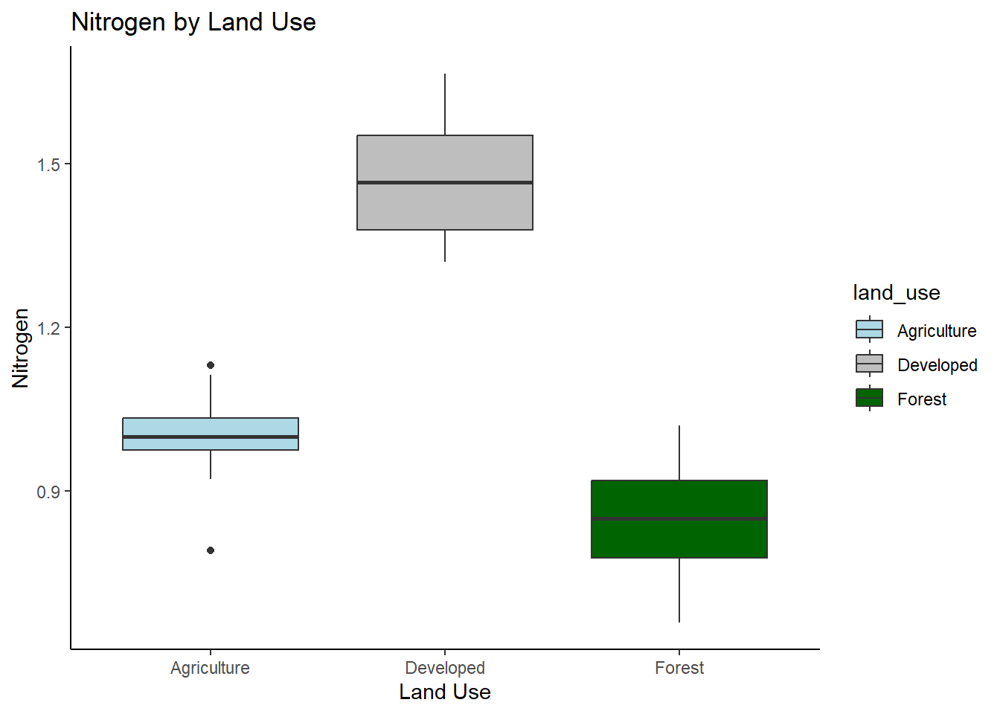

::: {.cell}
::: {.cell-output .cell-output-stderr}
```

Attaching package: 'dplyr'
```
:::

::: {.cell-output .cell-output-stderr}
```
The following objects are masked from 'package:stats':

    filter, lag
```
:::

::: {.cell-output .cell-output-stderr}
```
The following objects are masked from 'package:base':

    intersect, setdiff, setequal, union
```
:::
:::

::: {.cell}

```{.r .cell-code}
datum <- read_csv("C:/School/23SPDAY/FieldMethodsandTech/Practice Data/linear regression/anova/Class Activity 9.csv",
                             show_col_types = FALSE)
names(datum)[names(datum) == "Land use"] <- "land_use"
list(datum)
```

::: {.cell-output .cell-output-stdout}
```
[[1]]
# A tibble: 44 × 2
   land_use    Nitrogen
   <chr>          <dbl>
 1 Agriculture    0.986
 2 Agriculture    1.03 
 3 Agriculture    1.10 
 4 Agriculture    0.921
 5 Agriculture    0.976
 6 Agriculture    0.976
 7 Agriculture    1.03 
 8 Agriculture    0.951
 9 Agriculture    1.13 
10 Agriculture    0.974
# … with 34 more rows
```
:::
:::


## ANOVA analysis in R Studio

-   ANOVA can be used to **compare the means between three or more independent groups**

## ANOVA Testing: When and Why to Use ANOVA

### What is ANOVA

-   ANOVA (Analysis of Variance) is a statistical technique used to **compare means between three or more groups**.

-   ANOVA tests whether the differences between group means are statistically significant or simply due to chance.

-   The basic idea behind ANOVA is to partition the total variability in a dataset into two parts: variability between groups and variability within groups.

    -   If the variability between groups is much greater than the variability within groups, then it is likely that the group means are different and that the observed differences are not due to chance.

-   **F- Values** describe the **ratio of the variance between groups to the variance within groups**. It indicates the degree of variation in the dependent variable (in this case, the amount of nitrogen generated) that is explained by the independent variable (in this case, the land use types).

### Short Summary of the Math

------------------------------------------------------------------------

## Viewing the data

-   always start with viewing a table what the data contains and generating an exploratory graph to show the correlation you hope to predict

### Generating a Data Summary


::: {.cell}

```{.r .cell-code}
summary(datum)
```

::: {.cell-output .cell-output-stdout}
```
   land_use            Nitrogen     
 Length:44          Min.   :0.6585  
 Class :character   1st Qu.:0.8988  
 Mode  :character   Median :1.0152  
                    Mean   :1.1115  
                    3rd Qu.:1.3757  
                    Max.   :1.6658  
```
:::
:::


### Producing a plot


::: {.cell}

```{.r .cell-code}
datum %>% 
  ggplot(aes(x = land_use, y = Nitrogen, fill = land_use)) +
  geom_boxplot() +
  labs(x = "Land Use", y = "Nitrogen", title = "Nitrogen by Land Use") +
  scale_fill_manual(values = c("Agriculture" = "lightblue", "Forest" = "darkgreen", "Developed" = "gray")) +
  theme_classic()
```

::: {.cell-output-display}
{width=672}
:::
:::


::: {.callout-note .div style="border: 1px solid #ccc;   background-color: #f2f2f2;   color: #333;   padding: 10px;   margin: 10px 0;"}
## Observations

This graph suggests that **land use for developement** as a source of nitrogen seems to be significantly greater then both agriculture and forest. It also seems that the relationship between forest and agriculture is also significant.
:::

### Running an ANOVA to test the significant of this comparison


::: {.cell}

```{.r .cell-code}
results = aov(Nitrogen~as.factor(land_use), data= datum)

summary(results)
```

::: {.cell-output .cell-output-stdout}
```
                    Df Sum Sq Mean Sq F value Pr(>F)    
as.factor(land_use)  2  3.242  1.6210   153.6 <2e-16 ***
Residuals           41  0.433  0.0106                   
---
Signif. codes:  0 '***' 0.001 '**' 0.01 '*' 0.05 '.' 0.1 ' ' 1
```
:::
:::

::: {.cell}

```{.r .cell-code}
TukeyHSD(results)
```

::: {.cell-output .cell-output-stdout}
```
  Tukey multiple comparisons of means
    95% family-wise confidence level

Fit: aov(formula = Nitrogen ~ as.factor(land_use), data = datum)

$`as.factor(land_use)`
                            diff        lwr         upr     p adj
Developed-Agriculture  0.4780560  0.3852349  0.57087717 0.0000000
Forest-Agriculture    -0.1533935 -0.2462146 -0.06057233 0.0007017
Forest-Developed      -0.6314495 -0.7226562 -0.54024275 0.0000000
```
:::
:::


::: {.callout-note .div style="border: 1px solid #ccc;   background-color: #f2f2f2;   color: #333;   padding: 10px;   margin: 10px 0;"}
## Conclusion

The ANOVA test showed a significant difference in the mean amount of nitrogen generated between land uses (developed, agriculture, and forest) with a large F-value (153.6) suggesting a much greater variation between groups, then within them. and a p-value \< 0.05. The Tukey post-hoc analysis revealed that the mean amount of nitrogen generated in developed land use (mean = 2.74) was significantly higher than that of agriculture (mean = 2.26) and forest (mean = 2.59) land use with p-values \< 0.001 and \< 0.0001, respectively. On the other hand, the mean amount of nitrogen generated in forest land use was significantly lower than that of developed and agriculture land use with p-values \< 0.0001 and 0.0007, respectively. However, there was no significant difference in the mean amount of nitrogen generated between agriculture and forest land use (p = 0.70).
:::
