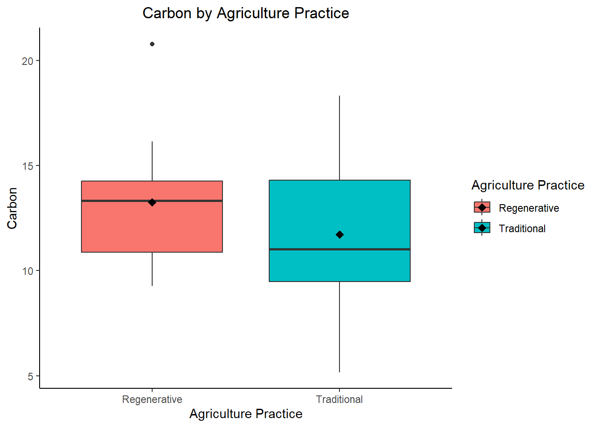
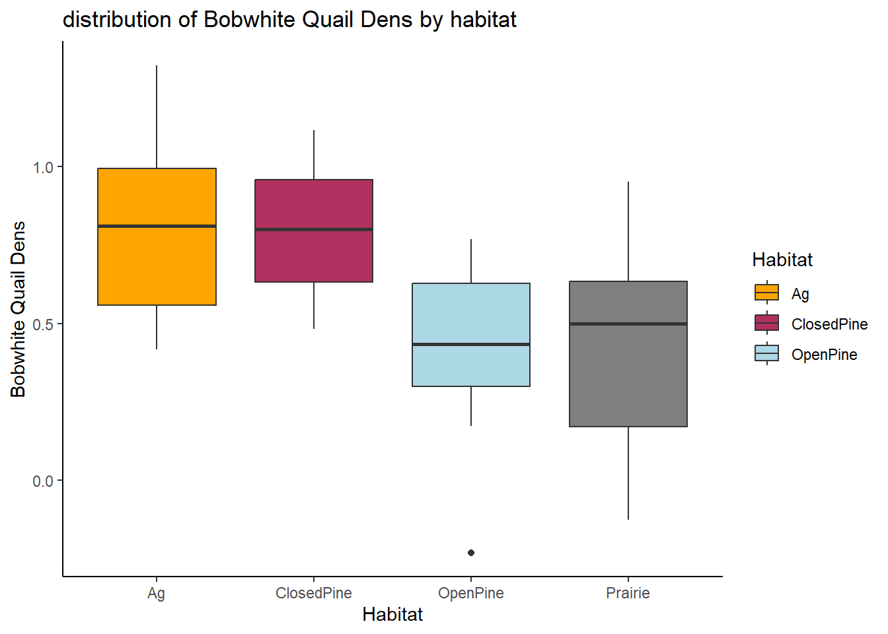

# Assignment 5: Applying t-test and ANOVA


::: {.cell}

```{.r .cell-code}
library(tidyr)
library(ggplot2)
library(kableExtra)
library(readr)
```
:::


## 5-1: Comparing the soil carbon concentration in traditional vs. regenerative agriculture - [t-test]{.underline} 


::: {.cell}

```{.r .cell-code}
datum <- read_csv("~/R/Field_methods/Week 9 Assignments/HW 5-dataset1.csv",
                  show_col_types = FALSE)
datum %>%
kable(digits = 4) %>%
  kable_styling(bootstrap_options = "striped", "hover")
```

::: {.cell-output-display}

`````{=html}
<table class="table table-striped" style="margin-left: auto; margin-right: auto;">
 <thead>
  <tr>
   <th style="text-align:left;"> Agriculture.Practice </th>
   <th style="text-align:right;"> Carbon </th>
  </tr>
 </thead>
<tbody>
  <tr>
   <td style="text-align:left;"> Traditional </td>
   <td style="text-align:right;"> 8.8575 </td>
  </tr>
  <tr>
   <td style="text-align:left;"> Traditional </td>
   <td style="text-align:right;"> 9.3341 </td>
  </tr>
  <tr>
   <td style="text-align:left;"> Traditional </td>
   <td style="text-align:right;"> 14.9729 </td>
  </tr>
  <tr>
   <td style="text-align:left;"> Traditional </td>
   <td style="text-align:right;"> 10.2046 </td>
  </tr>
  <tr>
   <td style="text-align:left;"> Traditional </td>
   <td style="text-align:right;"> 18.3221 </td>
  </tr>
  <tr>
   <td style="text-align:left;"> Traditional </td>
   <td style="text-align:right;"> 5.1771 </td>
  </tr>
  <tr>
   <td style="text-align:left;"> Traditional </td>
   <td style="text-align:right;"> 12.2556 </td>
  </tr>
  <tr>
   <td style="text-align:left;"> Traditional </td>
   <td style="text-align:right;"> 16.3186 </td>
  </tr>
  <tr>
   <td style="text-align:left;"> Traditional </td>
   <td style="text-align:right;"> 9.8851 </td>
  </tr>
  <tr>
   <td style="text-align:left;"> Traditional </td>
   <td style="text-align:right;"> 11.8626 </td>
  </tr>
  <tr>
   <td style="text-align:left;"> Regenerative </td>
   <td style="text-align:right;"> 9.2675 </td>
  </tr>
  <tr>
   <td style="text-align:left;"> Regenerative </td>
   <td style="text-align:right;"> 14.3923 </td>
  </tr>
  <tr>
   <td style="text-align:left;"> Regenerative </td>
   <td style="text-align:right;"> 16.1429 </td>
  </tr>
  <tr>
   <td style="text-align:left;"> Regenerative </td>
   <td style="text-align:right;"> 13.8928 </td>
  </tr>
  <tr>
   <td style="text-align:left;"> Regenerative </td>
   <td style="text-align:right;"> 10.8236 </td>
  </tr>
  <tr>
   <td style="text-align:left;"> Regenerative </td>
   <td style="text-align:right;"> 11.0546 </td>
  </tr>
  <tr>
   <td style="text-align:left;"> Regenerative </td>
   <td style="text-align:right;"> 9.6174 </td>
  </tr>
  <tr>
   <td style="text-align:left;"> Regenerative </td>
   <td style="text-align:right;"> 13.7621 </td>
  </tr>
  <tr>
   <td style="text-align:left;"> Regenerative </td>
   <td style="text-align:right;"> 20.7822 </td>
  </tr>
  <tr>
   <td style="text-align:left;"> Regenerative </td>
   <td style="text-align:right;"> 12.8872 </td>
  </tr>
</tbody>
</table>

`````

:::
:::

::: {.cell}

```{.r .cell-code}
datum %>%
  summary()
```

::: {.cell-output .cell-output-stdout}
```
 Agriculture.Practice     Carbon      
 Length:20            Min.   : 5.177  
 Class :character     1st Qu.: 9.818  
 Mode  :character     Median :12.059  
                      Mean   :12.491  
                      3rd Qu.:14.537  
                      Max.   :20.782  
```
:::
:::

::: {.cell}

```{.r .cell-code}
library(ggplot2)

ggplot(data = datum, aes(x = as.factor(Agriculture.Practice), y = Carbon, fill = as.factor(Agriculture.Practice))) +
  geom_boxplot() +
  stat_summary(fun = mean, geom = "point", shape = 18, size = 3, color = "black") +
  labs(x = "Agriculture Practice", y = "Carbon", fill = "Agriculture Practice", title = "Carbon by Agriculture Practice") +
  theme_classic() +
  theme(plot.title = element_text(hjust = 0.5))
```

::: {.cell-output-display}
{width=672}
:::
:::

::: {.cell}

```{.r .cell-code}
results=t.test(Carbon~Agriculture.Practice,data=datum,var.equal=FALSE)

results 
```

::: {.cell-output .cell-output-stdout}
```

	Welch Two Sample t-test

data:  Carbon by Agriculture.Practice
t = 0.93543, df = 17.716, p-value = 0.3621
alternative hypothesis: true difference in means between group Regenerative and group Traditional is not equal to 0
95 percent confidence interval:
 -1.926781  5.013289
sample estimates:
mean in group Regenerative  mean in group Traditional 
                  13.26227                   11.71902 
```
:::
:::


-   This model does not find a significant difference between the soil concentration in regenerative vs traditional agricultural practices. 95% confidence interval includes 0 indicating that there is not enough evidence to reject the null hypothesis of no difference in means between the two groups at a significance level of 0.05. ( t=0.9454, p=0.3621)

## 5-1: Comparing Four Bobwhite Quail Habitat types and population density - ANOVA


::: {.cell}

```{.r .cell-code}
datum <- read_csv("~/R/Field_methods/Week 9 Assignments/HW 5-dataset2.csv",
                  show_col_types = FALSE)
datum %>%
  kable() %>%
  kable_styling(bootstrap_options = "striped", "hover")
```

::: {.cell-output-display}

`````{=html}
<table class="table table-striped" style="margin-left: auto; margin-right: auto;">
 <thead>
  <tr>
   <th style="text-align:left;"> Habitat </th>
   <th style="text-align:right;"> QuailDens </th>
  </tr>
 </thead>
<tbody>
  <tr>
   <td style="text-align:left;"> OpenPine </td>
   <td style="text-align:right;"> 0.7686164 </td>
  </tr>
  <tr>
   <td style="text-align:left;"> OpenPine </td>
   <td style="text-align:right;"> 0.3755258 </td>
  </tr>
  <tr>
   <td style="text-align:left;"> OpenPine </td>
   <td style="text-align:right;"> 0.4783116 </td>
  </tr>
  <tr>
   <td style="text-align:left;"> OpenPine </td>
   <td style="text-align:right;"> 0.2734875 </td>
  </tr>
  <tr>
   <td style="text-align:left;"> OpenPine </td>
   <td style="text-align:right;"> -0.2298162 </td>
  </tr>
  <tr>
   <td style="text-align:left;"> OpenPine </td>
   <td style="text-align:right;"> 0.6410679 </td>
  </tr>
  <tr>
   <td style="text-align:left;"> OpenPine </td>
   <td style="text-align:right;"> 0.6477445 </td>
  </tr>
  <tr>
   <td style="text-align:left;"> OpenPine </td>
   <td style="text-align:right;"> 0.5834122 </td>
  </tr>
  <tr>
   <td style="text-align:left;"> OpenPine </td>
   <td style="text-align:right;"> 0.3911914 </td>
  </tr>
  <tr>
   <td style="text-align:left;"> OpenPine </td>
   <td style="text-align:right;"> 0.1736027 </td>
  </tr>
  <tr>
   <td style="text-align:left;"> Prairie </td>
   <td style="text-align:right;"> 0.9505746 </td>
  </tr>
  <tr>
   <td style="text-align:left;"> Prairie </td>
   <td style="text-align:right;"> 0.3453505 </td>
  </tr>
  <tr>
   <td style="text-align:left;"> Prairie </td>
   <td style="text-align:right;"> 0.4096394 </td>
  </tr>
  <tr>
   <td style="text-align:left;"> Prairie </td>
   <td style="text-align:right;"> 0.1139545 </td>
  </tr>
  <tr>
   <td style="text-align:left;"> Prairie </td>
   <td style="text-align:right;"> 0.5892843 </td>
  </tr>
  <tr>
   <td style="text-align:left;"> Prairie </td>
   <td style="text-align:right;"> 0.6438954 </td>
  </tr>
  <tr>
   <td style="text-align:left;"> Prairie </td>
   <td style="text-align:right;"> 0.6047102 </td>
  </tr>
  <tr>
   <td style="text-align:left;"> Prairie </td>
   <td style="text-align:right;"> -0.1246777 </td>
  </tr>
  <tr>
   <td style="text-align:left;"> Prairie </td>
   <td style="text-align:right;"> -0.0994187 </td>
  </tr>
  <tr>
   <td style="text-align:left;"> Prairie </td>
   <td style="text-align:right;"> 0.9385808 </td>
  </tr>
  <tr>
   <td style="text-align:left;"> ClosedPine </td>
   <td style="text-align:right;"> 0.7074961 </td>
  </tr>
  <tr>
   <td style="text-align:left;"> ClosedPine </td>
   <td style="text-align:right;"> 1.0002411 </td>
  </tr>
  <tr>
   <td style="text-align:left;"> ClosedPine </td>
   <td style="text-align:right;"> 0.8447862 </td>
  </tr>
  <tr>
   <td style="text-align:left;"> ClosedPine </td>
   <td style="text-align:right;"> 1.1158863 </td>
  </tr>
  <tr>
   <td style="text-align:left;"> ClosedPine </td>
   <td style="text-align:right;"> 0.8069477 </td>
  </tr>
  <tr>
   <td style="text-align:left;"> ClosedPine </td>
   <td style="text-align:right;"> 0.9938360 </td>
  </tr>
  <tr>
   <td style="text-align:left;"> ClosedPine </td>
   <td style="text-align:right;"> 0.5594187 </td>
  </tr>
  <tr>
   <td style="text-align:left;"> ClosedPine </td>
   <td style="text-align:right;"> 0.6054311 </td>
  </tr>
  <tr>
   <td style="text-align:left;"> ClosedPine </td>
   <td style="text-align:right;"> 0.7930546 </td>
  </tr>
  <tr>
   <td style="text-align:left;"> ClosedPine </td>
   <td style="text-align:right;"> 0.4831482 </td>
  </tr>
  <tr>
   <td style="text-align:left;"> Ag </td>
   <td style="text-align:right;"> 1.1964189 </td>
  </tr>
  <tr>
   <td style="text-align:left;"> Ag </td>
   <td style="text-align:right;"> 1.3222130 </td>
  </tr>
  <tr>
   <td style="text-align:left;"> Ag </td>
   <td style="text-align:right;"> 0.6448635 </td>
  </tr>
  <tr>
   <td style="text-align:left;"> Ag </td>
   <td style="text-align:right;"> 0.8051951 </td>
  </tr>
  <tr>
   <td style="text-align:left;"> Ag </td>
   <td style="text-align:right;"> 0.8160560 </td>
  </tr>
  <tr>
   <td style="text-align:left;"> Ag </td>
   <td style="text-align:right;"> 1.0147876 </td>
  </tr>
  <tr>
   <td style="text-align:left;"> Ag </td>
   <td style="text-align:right;"> 0.5282727 </td>
  </tr>
  <tr>
   <td style="text-align:left;"> Ag </td>
   <td style="text-align:right;"> 0.9329513 </td>
  </tr>
  <tr>
   <td style="text-align:left;"> Ag </td>
   <td style="text-align:right;"> 0.4162897 </td>
  </tr>
  <tr>
   <td style="text-align:left;"> Ag </td>
   <td style="text-align:right;"> 0.4833651 </td>
  </tr>
</tbody>
</table>

`````

:::
:::

::: {.cell}

```{.r .cell-code}
datum <- read_csv("~/R/Field_methods/Week 9 Assignments/HW 5-dataset2.csv",
                  show_col_types = FALSE)
summary(datum) %>%
  kable() %>%
  kable_styling(bootstrap_options = "striped", "hover")
```

::: {.cell-output-display}

`````{=html}
<table class="table table-striped" style="margin-left: auto; margin-right: auto;">
 <thead>
  <tr>
   <th style="text-align:left;">   </th>
   <th style="text-align:left;">   Habitat </th>
   <th style="text-align:left;">   QuailDens </th>
  </tr>
 </thead>
<tbody>
  <tr>
   <td style="text-align:left;">  </td>
   <td style="text-align:left;"> Length:40 </td>
   <td style="text-align:left;"> Min.   :-0.2298 </td>
  </tr>
  <tr>
   <td style="text-align:left;">  </td>
   <td style="text-align:left;"> Class :character </td>
   <td style="text-align:left;"> 1st Qu.: 0.4146 </td>
  </tr>
  <tr>
   <td style="text-align:left;">  </td>
   <td style="text-align:left;"> Mode  :character </td>
   <td style="text-align:left;"> Median : 0.6232 </td>
  </tr>
  <tr>
   <td style="text-align:left;">  </td>
   <td style="text-align:left;"> NA </td>
   <td style="text-align:left;"> Mean   : 0.6136 </td>
  </tr>
  <tr>
   <td style="text-align:left;">  </td>
   <td style="text-align:left;"> NA </td>
   <td style="text-align:left;"> 3rd Qu.: 0.8232 </td>
  </tr>
  <tr>
   <td style="text-align:left;">  </td>
   <td style="text-align:left;"> NA </td>
   <td style="text-align:left;"> Max.   : 1.3222 </td>
  </tr>
</tbody>
</table>

`````

:::
:::

::: {.cell}

```{.r .cell-code}
datum %>% 
  ggplot(aes(x = Habitat, y = QuailDens, fill = Habitat)) +
  geom_boxplot() +
  labs(x = "Habitat", y = "Bobwhite Quail Dens", title = "distribution of Bobwhite Quail Dens by habitat") +
  scale_fill_manual(values = c("OpenPine" = "lightblue", "ClosedPine" = "maroon", "Prarie" = "darkgreen", "Ag" = "orange")) +
  theme_classic()
```

::: {.cell-output-display}
{width=672}
:::
:::


hypothesis: From this graph, it looks like there will be no significant statistical difference between Agriculture and Closed pine habitats, or between Open Pine and Prairie habitats . However, between these two groups it seems likely that there will be a statistically significant difference in mean population density.


::: {.cell}

```{.r .cell-code}
results = aov(QuailDens~as.factor(Habitat), data= datum)

summary(results)
```

::: {.cell-output .cell-output-stdout}
```
                   Df Sum Sq Mean Sq F value Pr(>F)   
as.factor(Habitat)  3  1.449  0.4830   5.261 0.0041 **
Residuals          36  3.305  0.0918                  
---
Signif. codes:  0 '***' 0.001 '**' 0.01 '*' 0.05 '.' 0.1 ' ' 1
```
:::

```{.r .cell-code}
TukeyHSD(results)
```

::: {.cell-output .cell-output-stdout}
```
  Tukey multiple comparisons of means
    95% family-wise confidence level

Fit: aov(formula = QuailDens ~ as.factor(Habitat), data = datum)

$`as.factor(Habitat)`
                           diff        lwr         upr     p adj
ClosedPine-Ag       -0.02501669 -0.3899625  0.33992915 0.9977248
OpenPine-Ag         -0.40572691 -0.7706728 -0.04078107 0.0244214
Prairie-Ag          -0.37885197 -0.7437978 -0.01390612 0.0393922
OpenPine-ClosedPine -0.38071022 -0.7456561 -0.01576438 0.0381385
Prairie-ClosedPine  -0.35383527 -0.7187811  0.01111057 0.0602106
Prairie-OpenPine     0.02687494 -0.3380709  0.39182079 0.9971852
```
:::
:::


-   OpenPine-Ag: The estimated difference in population density between the OpenPine and Agriculture habitats is -0.41 individuals per hectare, with a 95% confidence interval ranging from -0.77 to -0.04 individuals per hectare (p = 0.02), indicating a statistically significant difference.

-   Prairie-Ag: The estimated difference in population density between the Prairie and Agriculture habitats is -0.38 individuals per hectare, with a 95% confidence interval ranging from -0.74 to -0.01 individuals per hectare (p = 0.04), indicating a statistically significant difference.

-   ClosedPine-Ag: The estimated difference in population density between the ClosedPine and Agriculture habitats is -0.03 individuals per hectare, with a 95% confidence interval ranging from -0.39 to 0.34 individuals per hectare (p = 0.99), indicating that there is no statistically significant difference.

-   OpenPine-ClosedPine: The estimated difference in population density between the OpenPine and ClosedPine habitats is -0.38 individuals per hectare, with a 95% confidence interval ranging from -0.75 to -0.02 individuals per hectare (p = 0.04), indicating a statistically significant difference.

-   Prairie-ClosedPine: The estimated difference in population density between the Prairie and ClosedPine habitats is -0.35 individuals per hectare, with a 95% confidence interval ranging from -0.72 to 0.01 individuals per hectare (p = 0.06), which is not statistically significant (i.e., p \> 0.05).

-   Prairie-OpenPine: The estimated difference in population density between the Prairie and OpenPine habitats is 0.03 individuals per hectare, with a 95% confidence interval ranging from -0.34 to 0.39 individuals per hectare (p = 0.99), indicating that there is no statistically significant difference.

the hypothesis is partially supported. The comparison between Agriculture and Closed Pine habitats did not show a significant difference in population density, which is consistent with the hypothesis. However, the comparison between Open Pine and Prairie habitats did not show a significant difference in population density, which is not consistent with the hypothesis. In addition, the comparison between Prairie and Closed Pine habitats had a p-value of 0.06, which is marginally above the threshold of 0.05 for statistical significance, suggesting a possible difference in population density that should be further investigated. Therefore, while the hypothesis correctly predicted one comparison, it was not entirely accurate for the other comparisons.

