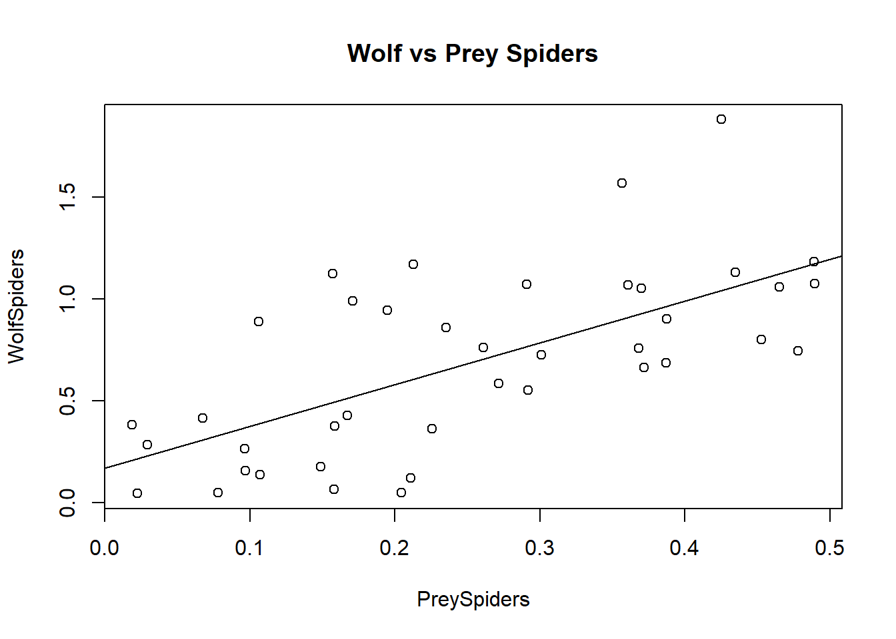
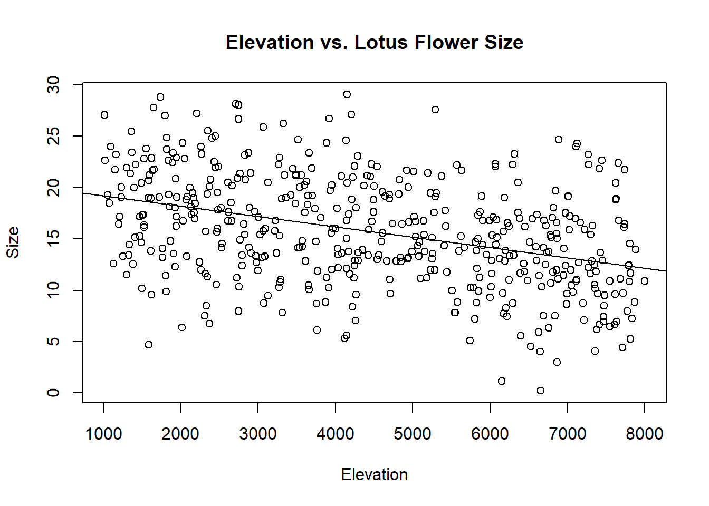
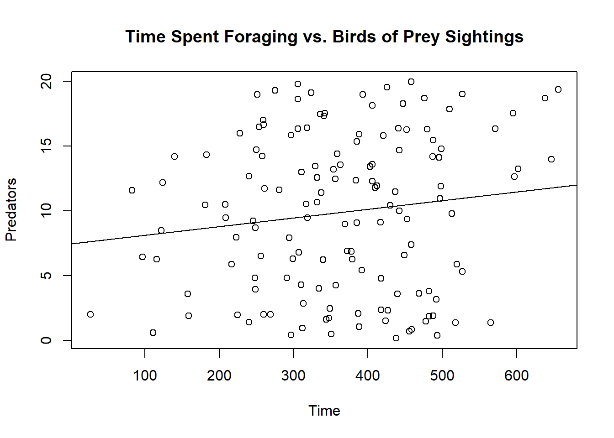

::: {.cell}

```{.r .cell-code}
library(readr)
Dataset_1 <- read_csv("C:/School/23SPDAY/FieldMethodsandTech/Practice Data/linear regression/Dataset 1.csv")
```

::: {.cell-output .cell-output-stderr}
```
Rows: 40 Columns: 2
── Column specification ────────────────────────────────────────────────────────
Delimiter: ","
dbl (2): PreySpiders, WolfSpiders

ℹ Use `spec()` to retrieve the full column specification for this data.
ℹ Specify the column types or set `show_col_types = FALSE` to quiet this message.
```
:::

```{.r .cell-code}
View(Dataset_1)

Dataset_2 <- read_csv("C:/School/23SPDAY/FieldMethodsandTech/Practice Data/linear regression/Dataset 2.csv")
```

::: {.cell-output .cell-output-stderr}
```
Rows: 473 Columns: 2
── Column specification ────────────────────────────────────────────────────────
Delimiter: ","
dbl (2): Elevation, Size

ℹ Use `spec()` to retrieve the full column specification for this data.
ℹ Specify the column types or set `show_col_types = FALSE` to quiet this message.
```
:::

```{.r .cell-code}
View(Dataset_2)

Dataset_3 <- read_csv("C:/School/23SPDAY/FieldMethodsandTech/Practice Data/linear regression/Dataset 3.csv")
```

::: {.cell-output .cell-output-stderr}
```
Rows: 140 Columns: 2
── Column specification ────────────────────────────────────────────────────────
Delimiter: ","
dbl (2): Time, Predators

ℹ Use `spec()` to retrieve the full column specification for this data.
ℹ Specify the column types or set `show_col_types = FALSE` to quiet this message.
```
:::

```{.r .cell-code}
View(Dataset_3)
```
:::


## 1. Wolf Spiders vs. Prey Spiders


::: {.cell}

```{.r .cell-code}
plot(WolfSpiders~PreySpiders, data = Dataset_1)

title(main = "Wolf vs Prey Spiders")

results = lm(WolfSpiders~PreySpiders, data = Dataset_1)

abline(results)
```

::: {.cell-output-display}
{width=672}
:::
:::

::: {.cell}

```{.r .cell-code}
results = lm(WolfSpiders~PreySpiders, data = Dataset_1)

summary(results)
```

::: {.cell-output .cell-output-stdout}
```

Call:
lm(formula = WolfSpiders ~ PreySpiders, data = Dataset_1)

Residuals:
     Min       1Q   Median       3Q      Max 
-0.53943 -0.25612 -0.07481  0.16258  0.83983 

Coefficients:
            Estimate Std. Error t value Pr(>|t|)    
(Intercept)   0.1697     0.1100   1.543    0.131    
PreySpiders   2.0527     0.3801   5.401 3.77e-06 ***
---
Signif. codes:  0 '***' 0.001 '**' 0.01 '*' 0.05 '.' 0.1 ' ' 1

Residual standard error: 0.3382 on 38 degrees of freedom
Multiple R-squared:  0.4343,	Adjusted R-squared:  0.4194 
F-statistic: 29.17 on 1 and 38 DF,  p-value: 3.77e-06
```
:::
:::


### Conclusion

**For each 1 spider/m2 increase in prey spiders, we observed a 2.05 spider/m2 increase in wolf spiders (p = 3.77x10\^-6; r\^2 = 0.419).**

## 2. Relationship Between Elevation and Size of Lotus Flowers


::: {.cell}

```{.r .cell-code}
plot(Size~Elevation, data = Dataset_2)
title(main = "Elevation vs. Lotus Flower Size")
results = lm(Size~Elevation, data = Dataset_2)
abline(results)
```

::: {.cell-output-display}
{width=672}
:::
:::

::: {.cell}

```{.r .cell-code}
results = lm(Size~Elevation, data = Dataset_2)
summary(results)
```

::: {.cell-output .cell-output-stdout}
```

Call:
lm(formula = Size ~ Elevation, data = Dataset_2)

Residuals:
     Min       1Q   Median       3Q      Max 
-13.9214  -3.2643  -0.1018   3.4679  13.0356 

Coefficients:
              Estimate Std. Error t value Pr(>|t|)    
(Intercept) 20.2230974  0.5498209  36.781   <2e-16 ***
Elevation   -0.0010102  0.0001118  -9.034   <2e-16 ***
---
Signif. codes:  0 '***' 0.001 '**' 0.01 '*' 0.05 '.' 0.1 ' ' 1

Residual standard error: 4.927 on 471 degrees of freedom
Multiple R-squared:  0.1477,	Adjusted R-squared:  0.1459 
F-statistic: 81.62 on 1 and 471 DF,  p-value: < 2.2e-16
```
:::
:::


### Conclusion

**For each 1000 meter increase in elevation, we observed a 1.01cm decrease in lotus flower size (p = 2 x 10\^-16; r\^2 = 0.1459).**

## 3. Relationship between Foraging Time and Bird of Prey Presence in Colombian Ground Squirrels


::: {.cell}

```{.r .cell-code}
plot(Predators~Time, data = Dataset_3)
title(main = "Time Spent Foraging vs. Birds of Prey Sightings")
results = lm(Predators~Time, data = Dataset_3)
abline(results)
```

::: {.cell-output-display}
{width=672}
:::
:::

::: {.cell}

```{.r .cell-code}
results = lm(Predators~Time, data = Dataset_3)
summary(results)
```

::: {.cell-output .cell-output-stdout}
```

Call:
lm(formula = Predators ~ Time, data = Dataset_3)

Residuals:
     Min       1Q   Median       3Q      Max 
-10.3518  -5.4773   0.8097   5.1510  10.3147 

Coefficients:
            Estimate Std. Error t value Pr(>|t|)    
(Intercept) 7.437309   1.577591   4.714 5.86e-06 ***
Time        0.006690   0.004115   1.626    0.106    
---
Signif. codes:  0 '***' 0.001 '**' 0.01 '*' 0.05 '.' 0.1 ' ' 1

Residual standard error: 5.985 on 138 degrees of freedom
Multiple R-squared:  0.01879,	Adjusted R-squared:  0.01168 
F-statistic: 2.643 on 1 and 138 DF,  p-value: 0.1063
```
:::
:::


### Conclusion

**For each 1 birds of prey increase measured the preceding day, we observed a 2.81 minute/day increase in time spent foraging by Colombian Squires (p = 0.106; r\^2 = 0.0117).**
