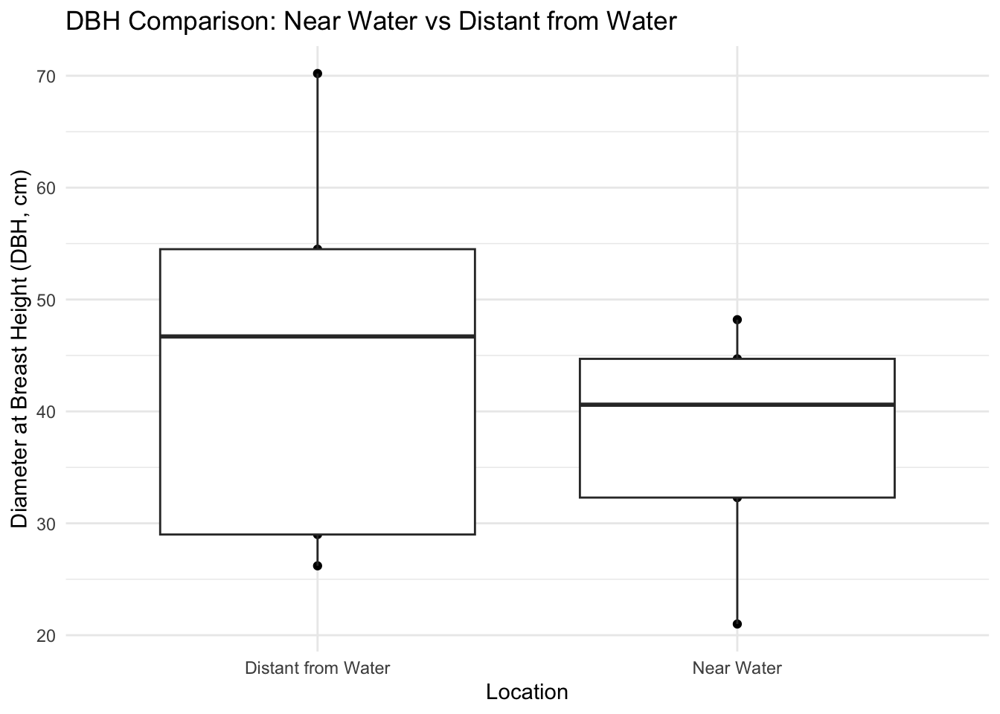

# SNHU Arboretum Stream Pollution Project


::: {.cell}

:::


## Abstract

------------------------------------------------------------------------

## Introduction

The objective of this study was to choose two five by five meter plots in the SNHU arboretum as representatives of tree size close to a water source, versus further away. For this first part of this study, the measurements taken in these plots are used to determine biomass, which can be leveraged to calculate carbon and CO2 sequestration using a given conversion factor. For the second part of this study, tree density calculated in these two plots will be used to try and estimate the amount of trees present, and by extension the amount of CO2 sequestered by the SNHU Arboretum.

This study collected measurements of diameter at breast height (DBH) for five trees within each of the plots. Because trees grow at fairly consistent rates (depending on the species), DBH is an essential metric in both forestry and environmental research for understanding a number of factors about a forest. On top of those being calculated in this study, DBH can be important for understanding tree age and health, wildlife habitat assessments, and forest management / inventory surveys.

Biomass is the mass of living organisms in a given area, and provides a crucial measurement for understanding ecological health and carbon sequestration in a forest or ecosystem. In this study, biomass is study in situ and only provides a estimated value; less accuracy, but at no cost to the trees or ecosystem @vorster2020. One of the most important characteristics

------------------------------------------------------------------------

## Materials and Methods

On March 20th, 2023, measurements were taken at the SNHU Arboretum in the vicinity of a stream pollution experiment scheduled for the remainder of the semester. In this study, biomass is calculated using the allometric scaling equation with the diameter at breast height (DBH) in centimeters. measurements were recorded directly into a word document using and iPad pro. Quality of the observations was accounted for by using multiple people to verify measurements. Plots were chosen for this experiment due to proximity to a water source, as well as elevation to see if any impact to DBH can be identified at a factor of access to water.

The initial step involved collecting DBH data for two sets of trees within 15 x 15-foot plots. This information will be beneficial when examining further details about the stream. The "near water" trees were measured within a range of 1 to 5 yards surrounding a seasonal second-order stream as it flows through a tunnel beneath a pathway. Located approximately 100 feet from the parking lot, this plot experiences significant foot traffic. The "distant from water" plot was situated roughly 75 feet from the initial point, away from pedestrian areas. Trees within a 15 square feet cluster were measured at breast height using a tape measure.

The following code was created to analyze the DBH data. Both datasets are initially converted into a data frame in R Studio. Ideally, the original Excel file should be linked, but since the data set only comprises 10 variables, manually entering the DBH values into R is the most straightforward approach. The code's annotations provide detailed explanations of the calculations, eliminating the need for a separate methods description.

------------------------------------------------------------------------

### I - Calculating Biomass, Carbon & CO2 Sequestration for Each Plots


::: {.cell}

```{.r .cell-code}
# Generate variables for each set of vectors
dbh_near_water <- c(48.2, 32.3, 40.6, 21.0, 44.7)
dbh_distant_from_water <- c(54.5, 70.2, 29.0, 26.2, 46.7)

# Convert DBH from inches to centimeters
#dbh_near_water <- dbh_near_water * 2.54
#dbh_distant_from_water <- dbh_distant_from_water * 2.54

# Reshape datasets into dataframes and merge into a dataframe
df_near_water <- data.frame(DBH = dbh_near_water, Location = "Near Water")

df_distant_from_water <- data.frame(DBH = dbh_distant_from_water, Location = "Distant from Water")

combined_df <- rbind(df_near_water, df_distant_from_water)

# Add a column to the dataframe for biomass
## Biomass is calculated using the allometric equation provided in class
combined_df$"Biomass (kg/tree)" <- (41.173 * combined_df$DBH - 409.5)


# Add a column for Carbon (kg/tree) 
## Carbon is found by multiplying biomass by the % mass that is carbon. This value (45%) provides a general estimate for carbon, useful for in situ studies. 
combined_df$"Carbon (kg/tree)" <- combined_df$Biomass * 0.45

# Add a column for CO2 (kg/tree)
## CO2 is found by multiplying Carbon by the difference between the molar masses. This is done to determine the amount of potential atmospheric carbon that could be generated if the tree was used for combustion. 
combined_df$"CO2_per_tree (kg/tree)" <- (combined_df$Carbon * 3.66666666667)
```
:::


#### Listing results


::: {.cell}

```{.r .cell-code}
combined_df %>%
  
      mutate_if(is.numeric, comma) %>%

  kable(digits = 1) %>%
  kable_styling(bootstrap_options = "striped", "hover")
```

::: {.cell-output-display}

`````{=html}
<table class="table table-striped" style="margin-left: auto; margin-right: auto;">
 <thead>
  <tr>
   <th style="text-align:left;"> DBH </th>
   <th style="text-align:left;"> Location </th>
   <th style="text-align:left;"> Biomass (kg/tree) </th>
   <th style="text-align:left;"> Carbon (kg/tree) </th>
   <th style="text-align:left;"> CO2_per_tree (kg/tree) </th>
  </tr>
 </thead>
<tbody>
  <tr>
   <td style="text-align:left;"> 48.2 </td>
   <td style="text-align:left;"> Near Water </td>
   <td style="text-align:left;"> 1,575 </td>
   <td style="text-align:left;"> 709 </td>
   <td style="text-align:left;"> 2,599 </td>
  </tr>
  <tr>
   <td style="text-align:left;"> 32.3 </td>
   <td style="text-align:left;"> Near Water </td>
   <td style="text-align:left;"> 920 </td>
   <td style="text-align:left;"> 414 </td>
   <td style="text-align:left;"> 1,519 </td>
  </tr>
  <tr>
   <td style="text-align:left;"> 40.6 </td>
   <td style="text-align:left;"> Near Water </td>
   <td style="text-align:left;"> 1,262 </td>
   <td style="text-align:left;"> 568 </td>
   <td style="text-align:left;"> 2,083 </td>
  </tr>
  <tr>
   <td style="text-align:left;"> 21.0 </td>
   <td style="text-align:left;"> Near Water </td>
   <td style="text-align:left;"> 455 </td>
   <td style="text-align:left;"> 205 </td>
   <td style="text-align:left;"> 751 </td>
  </tr>
  <tr>
   <td style="text-align:left;"> 44.7 </td>
   <td style="text-align:left;"> Near Water </td>
   <td style="text-align:left;"> 1,431 </td>
   <td style="text-align:left;"> 644 </td>
   <td style="text-align:left;"> 2,361 </td>
  </tr>
  <tr>
   <td style="text-align:left;"> 54.5 </td>
   <td style="text-align:left;"> Distant from Water </td>
   <td style="text-align:left;"> 1,834 </td>
   <td style="text-align:left;"> 825 </td>
   <td style="text-align:left;"> 3,027 </td>
  </tr>
  <tr>
   <td style="text-align:left;"> 70.2 </td>
   <td style="text-align:left;"> Distant from Water </td>
   <td style="text-align:left;"> 2,481 </td>
   <td style="text-align:left;"> 1,116 </td>
   <td style="text-align:left;"> 4,093 </td>
  </tr>
  <tr>
   <td style="text-align:left;"> 29.0 </td>
   <td style="text-align:left;"> Distant from Water </td>
   <td style="text-align:left;"> 785 </td>
   <td style="text-align:left;"> 353 </td>
   <td style="text-align:left;"> 1,294 </td>
  </tr>
  <tr>
   <td style="text-align:left;"> 26.2 </td>
   <td style="text-align:left;"> Distant from Water </td>
   <td style="text-align:left;"> 669 </td>
   <td style="text-align:left;"> 301 </td>
   <td style="text-align:left;"> 1,104 </td>
  </tr>
  <tr>
   <td style="text-align:left;"> 46.7 </td>
   <td style="text-align:left;"> Distant from Water </td>
   <td style="text-align:left;"> 1,513 </td>
   <td style="text-align:left;"> 681 </td>
   <td style="text-align:left;"> 2,497 </td>
  </tr>
</tbody>
</table>

`````

:::
:::


------------------------------------------------------------------------

### II - Calculating Averages for Each Plot


::: {.cell}

```{.r .cell-code}
combined_df %>%
  group_by(Location) %>%
summarise("Average Biomass (kg/tree)" = mean(`Biomass (kg/tree)`),
           "Average Carbon (kg/tree)" = mean(`Carbon (kg/tree)`),
           "Average CO2 (kg/tree)" = mean(`CO2_per_tree (kg/tree)`)
           )%>%
kable(digits = 1) %>%
  kable_styling(bootstrap_options = "striped", "hover")
```

::: {.cell-output-display}

`````{=html}
<table class="table table-striped" style="margin-left: auto; margin-right: auto;">
 <thead>
  <tr>
   <th style="text-align:left;"> Location </th>
   <th style="text-align:right;"> Average Biomass (kg/tree) </th>
   <th style="text-align:right;"> Average Carbon (kg/tree) </th>
   <th style="text-align:right;"> Average CO2 (kg/tree) </th>
  </tr>
 </thead>
<tbody>
  <tr>
   <td style="text-align:left;"> Distant from Water </td>
   <td style="text-align:right;"> 1456.5 </td>
   <td style="text-align:right;"> 655.4 </td>
   <td style="text-align:right;"> 2403.2 </td>
  </tr>
  <tr>
   <td style="text-align:left;"> Near Water </td>
   <td style="text-align:right;"> 1128.7 </td>
   <td style="text-align:right;"> 507.9 </td>
   <td style="text-align:right;"> 1862.4 </td>
  </tr>
</tbody>
</table>

`````

:::
:::


#### Graphing Results


::: {.cell}

```{.r .cell-code}
# Plot the data
ggplot(combined_df) +
  geom_point(aes(Location,DBH)) +
  geom_boxplot(aes(Location,DBH)) +
  labs(title = "DBH Comparison: Near Water vs Distant from Water",
       x = "Location",
       y = "Diameter at Breast Height (DBH, cm)") +
  theme_minimal()
```

::: {.cell-output-display}
{width=672}
:::
:::


### Running t-test for to compare DBH between the plots


::: {.cell}

```{.r .cell-code}
t.test(dbh_distant_from_water,dbh_near_water)
```

::: {.cell-output .cell-output-stdout}
```

	Welch Two Sample t-test

data:  dbh_distant_from_water and dbh_near_water
t = 0.83622, df = 6.524, p-value = 0.4326
alternative hypothesis: true difference in means is not equal to 0
95 percent confidence interval:
 -14.88615  30.80615
sample estimates:
mean of x mean of y 
    45.32     37.36 
```
:::
:::


------------------------------------------------------------------------

### III - Extrapolating the Results for the Arboretum


::: {.cell}

```{.r .cell-code}
  combined_df %>%
    
    summarise(
     "Total CO2 in Plot (kg/tree)" = 2132.8,
     "Plot Size (m^2)" = "6.5",
     "Tree Density (trees/m^2)" = "1.5",
     "Arboretum Area (m^2)" = 97124,
     "# in Arboretum Trees" = 97124.6 * 1.5,
     "CO2 in Arboretum (kg)" = 145686.9 * 2132.8
    ) %>%
    
    mutate_if(is.numeric, comma) %>%
    
    kable(digits = 1) %>%
  kable_styling(bootstrap_options = "striped", "hover")
```

::: {.cell-output-display}

`````{=html}
<table class="table table-striped" style="margin-left: auto; margin-right: auto;">
 <thead>
  <tr>
   <th style="text-align:left;"> Total CO2 in Plot (kg/tree) </th>
   <th style="text-align:left;"> Plot Size (m^2) </th>
   <th style="text-align:left;"> Tree Density (trees/m^2) </th>
   <th style="text-align:left;"> Arboretum Area (m^2) </th>
   <th style="text-align:left;"> # in Arboretum Trees </th>
   <th style="text-align:left;"> CO2 in Arboretum (kg) </th>
  </tr>
 </thead>
<tbody>
  <tr>
   <td style="text-align:left;"> 2,133 </td>
   <td style="text-align:left;"> 6.5 </td>
   <td style="text-align:left;"> 1.5 </td>
   <td style="text-align:left;"> 97,124 </td>
   <td style="text-align:left;"> 145,687 </td>
   <td style="text-align:left;"> 310,721,020 </td>
  </tr>
</tbody>
</table>

`````

:::
:::


------------------------------------------------------------------------

## Results

Based on the t-test results for these two groups (t = 0.83622, df = 6.524, p-value = 0.4326), there is no significant difference between the mean DBH of trees near water ( mean = 37.36 cm) and distant from water ( mean = 45.32 cm) at the 95% confidence level. The confidence interval for the difference in means ranges from -14.89 to 30.81, which includes zero, further indicating that the true difference in means might be insignificant.

It is likely the small sample size has an impact of the results of this experiment and expanding the amount of trees observed in each group may provide a more clear deviation between the two groups. Another metric that would likely greatly improve accuracy is a height, which can be used to generate a more accurate estimation for biomass. Overall, this project is a relatively low-confidence example of a CO2 calculation, but accurately describes the process by which this is done.

The results of this this study were used in part III to attempt to estimate the total carbon sequestration present in the biomass in the SNHU arboretum. These results were estimated based of a 24 square mile estimate found @Arbnet

Considering the graph, this does seem to support a statistically significant difference between the measurements taken near and far from the stream. Distant from the water, there seems to be a significant amount of deviation from the mean that could account for a much less significant difference between these two groups.
